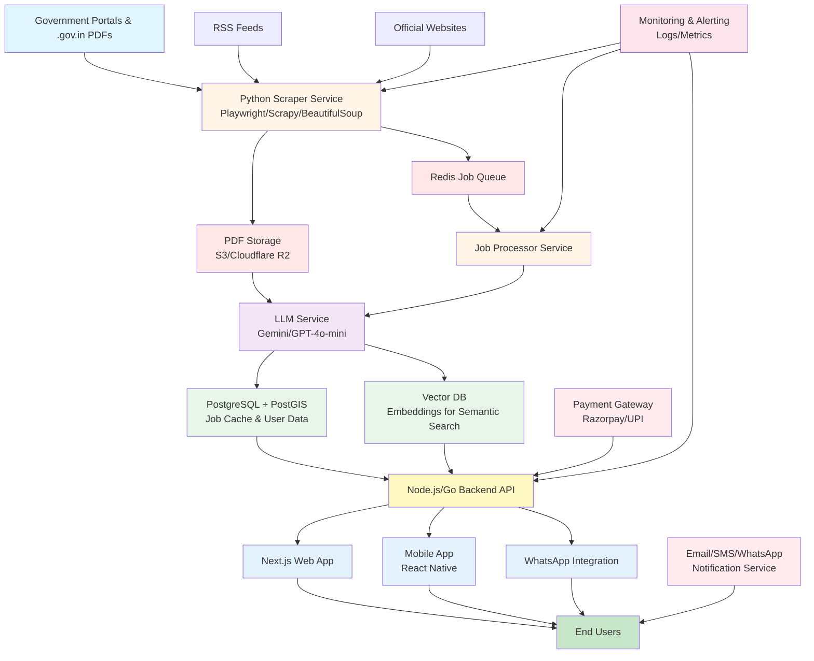

# System Architecture - Learn Govt Jobs Platform

## Overview

This document outlines the complete system architecture for the Learn Govt Jobs platform, a comprehensive government job notification aggregator with AI-powered matching and personalized recommendations.

## High-Level Architecture Diagram



## Detailed Architecture

### 1. Data Collection Layer

#### 1.1 Scraping Service (Python)
**Technology Stack:** Python 3.10+, Playwright, Scrapy, BeautifulSoup4

**Components:**
- **Portal Scrapers**: Dedicated scrapers for major government job portals
  - Employment News
  - UPSC
  - SSC
  - Railway Recruitment Boards
  - State PSCs
  - Banking recruitment (IBPS, SBI, RBI)
  
- **PDF Parser**: Extract text from PDF notifications
  - PyPDF2 for standard PDFs
  - OCR (Tesseract/Google Vision API) for scanned documents
  - Hindi/Regional language support via Google Translate API

- **Scheduler**: Cron-based or custom scheduler
  - Different frequencies per source (hourly, daily, weekly)
  - Priority-based scheduling
  - Retry logic with exponential backoff

**Best Practices:**
- Respect `robots.txt` for all sources
- Implement rate limiting (max 1 req/sec per domain)
- Use rotating user agents
- Add random delays between requests (1-3 seconds)
- Monitor for site structure changes
- Log all scraping activities
- Implement circuit breakers for failing sources

#### 1.2 Data Ingestion Queue
**Technology:** Redis with pub/sub

**Purpose:**
- Decouple scraping from processing
- Handle traffic spikes
- Enable horizontal scaling
- Provide job persistence

### 2. Processing Layer

#### 2.1 Job Processor Service
**Technology:** Node.js or Go

**Responsibilities:**
- Validate scraped data
- Normalize job information
- Deduplicate jobs
- Extract structured data from unstructured text
- Queue jobs for AI processing

#### 2.2 AI/LLM Service
**Technology:** Gemini API or GPT-4o-mini

**Use Cases:**

1. **Notification Parsing**
   - Extract key information from PDFs
   - Support Hindi and regional languages
   - Structure unstructured content

2. **Content Summarization**
   - Generate 2-3 sentence summaries
   - Highlight key dates and requirements
   - Create user-friendly descriptions

3. **Tag Extraction**
   - Automatic categorization
   - Skill identification
   - Department classification

4. **Match Score Calculation**
   - Compare user profile with job requirements
   - Generate personalized match scores (0-100)
   - Provide reasoning for scores
   - Suggest improvements

**Prompt Examples:**

```
Analyze this government job notification and extract:
1. Organization name
2. Post name and number of vacancies
3. Eligibility criteria (age, qualification, experience)
4. Important dates (application start/end, exam date)
5. Application fee details
6. Required documents

[PDF/HTML content]

Return as structured JSON.
```

```
Generate a match score (0-100) for this user and job:

User Profile:
- Age: 25
- Qualification: B.Tech in Computer Science
- State: Karnataka
- Category: General

Job Requirements:
- Age: 21-30
- Qualification: Graduate in any discipline
- State: Karnataka
- Posts: 50 (General: 25, OBC: 15, SC: 7, ST: 3)

Provide:
1. Overall match score
2. Component scores (location, qualification, eligibility, age)
3. Strengths (what matches well)
4. Gaps (what doesn't match)
5. Recommendations for user
```

### 3. Data Storage Layer

#### 3.1 PostgreSQL Database
**Version:** PostgreSQL 14+ with PostGIS extension

**Key Features:**
- JSONB fields for flexible data (vacancies, qualifications, AI tags)
- Full-text search with GIN indexes
- Geo-spatial queries for location-based filtering
- Array fields for multi-district jobs
- Triggers for auto-updating timestamps

**Optimization Strategies:**
- Index commonly filtered columns (state, category, dates)
- GIN indexes for JSONB fields
- Materialized views for complex aggregations
- Partition large tables by date
- Connection pooling (PgBouncer)

#### 3.2 Vector Database
**Technology:** Pinecone or PostgreSQL with pgvector

**Purpose:**
- Store job embeddings for semantic search
- Enable "jobs similar to this" feature
- Improve search relevance

#### 3.3 Cache Layer
**Technology:** Redis

**Cached Data:**
- Popular search queries (TTL: 1 hour)
- User session data
- Frequently accessed job details
- Geographic lookup tables (states, districts)
- Match scores (TTL: 24 hours)

**Cache Invalidation:**
- Time-based expiration
- Event-based invalidation (new jobs, job updates)
- LRU eviction for memory management

#### 3.4 File Storage
**Technology:** AWS S3, Cloudflare R2, or local storage

**Stored Files:**
- Original PDF notifications
- User profile pictures
- Generated certificates
- Static assets

### 4. Backend API Layer

#### 4.1 API Server
**Technology:** Node.js (Express/Fastify) or Go (Gin/Echo)

**Endpoints:**

**Public APIs:**
- `GET /api/jobs` - List jobs with filters
- `GET /api/jobs/:id` - Get job details
- `GET /api/states` - List states
- `GET /api/districts/:stateId` - List districts
- `GET /api/categories` - List job categories

**Authenticated APIs:**
- `POST /api/auth/register` - User registration
- `POST /api/auth/login` - User login
- `GET /api/user/profile` - Get user profile
- `PUT /api/user/profile` - Update profile
- `GET /api/user/matches` - Get personalized job matches
- `POST /api/jobs/:id/save` - Save job
- `POST /api/jobs/:id/apply` - Mark as applied
- `GET /api/user/saved-jobs` - Get saved jobs
- `POST /api/alerts` - Create job alert
- `GET /api/alerts` - Get user alerts

**Admin APIs:**
- `GET /api/admin/jobs` - Manage jobs
- `GET /api/admin/scrapers` - Monitor scrapers
- `GET /api/admin/users` - User management
- `GET /api/admin/analytics` - Platform analytics

**Payment APIs:**
- `POST /api/payment/initiate` - Start payment
- `POST /api/payment/verify` - Verify payment
- `GET /api/subscription/status` - Check subscription

**Performance Features:**
- Request validation (Zod/Joi)
- Rate limiting (by IP and user)
- Response compression
- CORS configuration
- JWT authentication
- API versioning

### 5. Frontend Layer

#### 5.1 Web Application (Next.js)
**Technology:** Next.js 14+, React 19, Tailwind CSS

**Key Pages:**

1. **Homepage** (Search-first design)
   - Prominent search bar
   - Distinct dropdowns for:
     - State
     - District
     - Taluk
     - Job category
     - Qualification
   - Recent/trending jobs
   - Quick filters

2. **Job Listing Page**
   - Filterable job cards
   - Infinite scroll/pagination
   - Sort options (date, match score, deadline)
   - View toggle (grid/list)

3. **Job Detail Page**
   - Full job information
   - AI-generated summary
   - Match score with reasoning (for logged-in users)
   - Document checklist
   - Dynamic timeline showing:
     - Application period
     - Exam date
     - Result date
     - Current status indicator
   - Similar jobs
   - Share button (WhatsApp, social media)
   - Save/Apply buttons

4. **Personalized Dashboard**
   - Match scores for recommended jobs
   - Reasoning for each match
   - Saved jobs
   - Applied jobs with status
   - Upcoming deadlines
   - Exam reminders

5. **Profile Page**
   - Personal information
   - Educational qualifications
   - Work experience
   - Geographic preferences
   - Notification settings

**UI/UX Principles:**

- **Mobile-first design** - Most users will access on mobile
- **Progressive Web App (PWA)** - Enable offline access
- **Simplified language** - Avoid technical jargon
- **Visual hierarchy** - Important info (deadlines) prominently displayed
- **Trust indicators**:
  - Source domain clearly visible
  - "AI-generated" badges on summaries
  - Disclaimer about verifying from official source
  - Last updated timestamp
- **Accessibility**:
  - High contrast mode
  - Screen reader support
  - Keyboard navigation
  - Font size adjustment

**Match Score Display:**
- Large percentage (e.g., "85% Match")
- Color-coded: Green (>75%), Yellow (50-75%), Orange (<50%)
- Expandable reasoning section showing:
  - What matches well
  - What doesn't match
  - How to improve match
- Component breakdown (location, qualification, age, experience)

**Credibility Features:**
- "Verified" badge for manually reviewed jobs
- Source link to official notification
- PDF download link
- "AI-assisted" label for AI-processed content
- User reports for incorrect information

#### 5.2 Mobile Application (React Native)
**Technology:** React Native, Expo

**Additional Mobile Features:**
- Offline job saving (download PDFs)
- Push notifications
- Biometric authentication
- Quick share via WhatsApp
- Bottom navigation for easy thumb reach
- Swipe gestures for saved/applied actions

**Rural User Considerations:**
- Work on 2G/3G networks (optimize images, lazy loading)
- Lightweight app size (<10 MB)
- Hindi and regional language support
- Voice search
- Simplified onboarding

### 6. Integration Layer

#### 6.1 Payment Integration
**Provider:** Razorpay

**Flow:**
1. User selects subscription plan (₹99/year)
2. Frontend calls `/api/payment/initiate`
3. Razorpay checkout opens
4. User completes payment via UPI/Card/Net Banking
5. Razorpay webhook notifies backend
6. Backend verifies payment signature
7. Updates user subscription status
8. Sends confirmation email/SMS

**Features:**
- Support for UPI, Cards, Net Banking, Wallets
- Auto-retry for failed payments
- Refund handling
- Invoice generation

#### 6.2 Notification System
**Providers:** 
- Email: Resend, SendGrid
- SMS: Twilio, MSG91
- WhatsApp: Twilio, Gupshup

**Notification Types:**
- Job alerts (daily/weekly digest)
- Application deadline reminders
- Exam date reminders
- New matching jobs
- Application status updates
- Subscription reminders

**WhatsApp Integration:**
- Opt-in via checkbox during registration
- Send job cards with rich formatting
- Share button generates WhatsApp link with pre-filled message
- Daily/weekly job summary messages

**Implementation:**
- Queue-based delivery (Redis/BullMQ)
- Retry failed messages
- Track delivery status
- Unsubscribe handling
- Rate limiting to avoid spam

### 7. Monitoring & Observability

#### 7.1 Application Monitoring
**Tools:** 
- Logging: Winston, Pino
- Metrics: Prometheus
- Tracing: Jaeger, OpenTelemetry
- Dashboards: Grafana

**Key Metrics:**
- API response times
- Error rates
- Database query performance
- Cache hit rates
- Active users
- Jobs scraped per day
- Match score calculation time

#### 7.2 Scraper Monitoring
**Alerts for:**
- Scraper failures (after 3 retries)
- Zero jobs found (potential site change)
- Parsing errors (>10% failure rate)
- Rate limit hits
- Long scraping duration (>expected time)

**Dashboard:**
- Last successful scrape per source
- Jobs added in last 24 hours
- Error logs
- Source health status

### 8. Security & Compliance

#### 8.1 Security Measures
- HTTPS only (SSL/TLS)
- JWT-based authentication
- Password hashing (bcrypt/argon2)
- SQL injection prevention (parameterized queries)
- XSS protection (sanitize user input)
- CSRF tokens
- Rate limiting on auth endpoints
- API key rotation
- Secrets in environment variables
- Regular security audits

#### 8.2 Data Privacy
- GDPR-compliant data handling
- User data encryption at rest
- Secure session management
- Right to delete account
- Privacy policy and ToS
- Cookie consent
- No selling of user data

#### 8.3 Scraping Ethics
- Only scrape public data
- Respect robots.txt
- Implement rate limits
- Use official APIs when available
- Attribute sources properly
- Monitor for cease-and-desist notices

### 9. Deployment Architecture

#### 9.1 Infrastructure
**Option 1: Cloud (AWS/GCP/Azure)**
- Application: ECS/Cloud Run/App Service
- Database: RDS PostgreSQL/Cloud SQL
- Cache: ElastiCache Redis/Memorystore
- Storage: S3/Cloud Storage
- CDN: CloudFront/Cloud CDN

**Option 2: Self-hosted (PM2)**
- Application: PM2 process manager
- Database: Self-hosted PostgreSQL
- Cache: Self-hosted Redis
- Storage: Local/Backblaze B2
- Reverse Proxy: Nginx

#### 9.2 CI/CD Pipeline
1. Code push to GitHub
2. Automated tests run
3. Linting and security scans
4. Build Docker images
5. Push to registry
6. Deploy to staging
7. Run integration tests
8. Deploy to production
9. Health checks
10. Rollback on failure

### 10. Scalability Considerations

#### 10.1 Horizontal Scaling
- Stateless API servers (can run multiple instances)
- Load balancer (Nginx/HAProxy)
- Database read replicas
- Cache cluster (Redis Sentinel)
- Distributed scraping (multiple workers)

#### 10.2 Vertical Scaling
- Increase database resources for complex queries
- More memory for Redis cache
- More CPU for AI processing

#### 10.3 Database Optimization
- Table partitioning by date
- Archive old jobs (>1 year)
- Index optimization
- Query optimization
- Connection pooling

### 11. Cost Optimization

- Use free tiers (Supabase, Vercel, Railway)
- Cache aggressively to reduce database load
- Compress images and assets
- Use CDN for static content
- Optimize AI API calls (batch processing)
- Monitor and alert on unusual usage

## Technology Stack Summary

| Layer | Technology |
|-------|------------|
| **Frontend** | Next.js 14+, React 19, Tailwind CSS |
| **Mobile** | React Native, Expo |
| **Backend API** | Node.js (Express/Fastify) or Go |
| **Scraping** | Python, Playwright, Scrapy, BeautifulSoup |
| **Database** | PostgreSQL 14+ with PostGIS |
| **Cache** | Redis |
| **AI/LLM** | Gemini API or GPT-4o-mini |
| **File Storage** | S3/R2/Local |
| **Payments** | Razorpay |
| **Notifications** | Resend (email), Twilio (SMS/WhatsApp) |
| **Monitoring** | Winston, Prometheus, Grafana |
| **Deployment** | PM2, Docker, or Cloud services |

## Implementation Phases

### Phase 1: MVP (Months 1-2)
- Basic scraper for 2-3 major sources
- PostgreSQL schema
- REST API with core endpoints
- Simple Next.js frontend with search
- Manual job matching

### Phase 2: AI Integration (Months 3-4)
- LLM integration for parsing and summarization
- AI-powered match score calculation
- Personalized dashboard
- Job alerts

### Phase 3: Mobile & Notifications (Months 5-6)
- React Native app
- Push notifications
- WhatsApp integration
- Offline support

### Phase 4: Optimization & Scale (Months 7-8)
- Performance optimization
- Advanced caching
- Vector search
- Analytics dashboard

### Phase 5: Advanced Features (Ongoing)
- Interview preparation
- Resume builder
- Mock tests
- Community forum

## Success Metrics

- **User Engagement**: DAU/MAU ratio >30%
- **Match Accuracy**: >80% of users find matches relevant
- **Conversion**: >10% of free users subscribe
- **Retention**: >50% of paid users renew
- **Jobs Coverage**: >90% of major government jobs listed
- **Scraper Uptime**: >99.5%
- **API Response Time**: p95 <500ms

## Conclusion

This architecture provides a scalable, maintainable, and user-friendly platform for government job seekers in India. The design emphasizes:

1. **Reliability**: Robust scraping with monitoring
2. **Intelligence**: AI-powered matching and recommendations
3. **Accessibility**: Mobile-first, multilingual, rural-friendly
4. **Trust**: Transparent sourcing and AI labeling
5. **Compliance**: Ethical scraping and data privacy

With this architecture, the Learn Govt Jobs platform can serve millions of users while maintaining performance, accuracy, and user trust.
