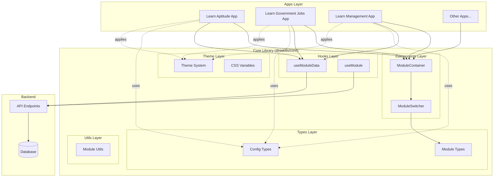
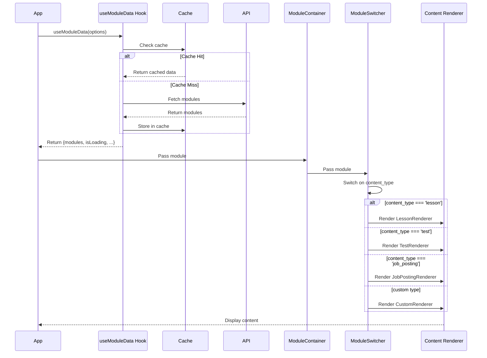
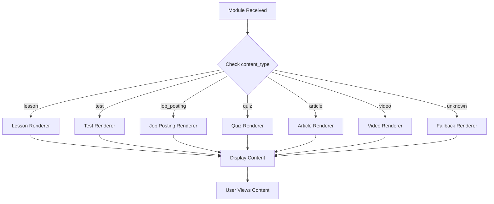
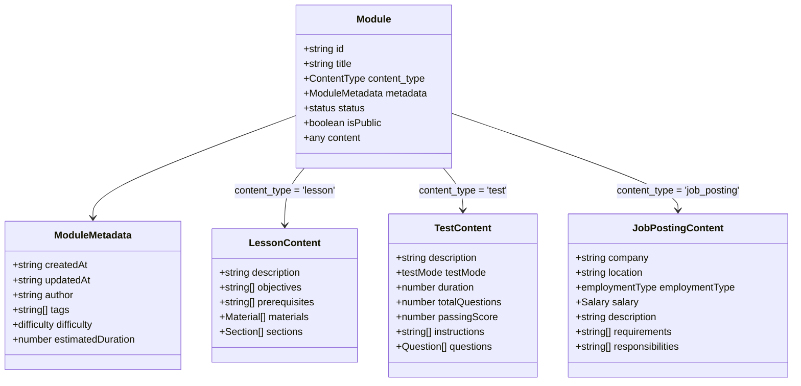
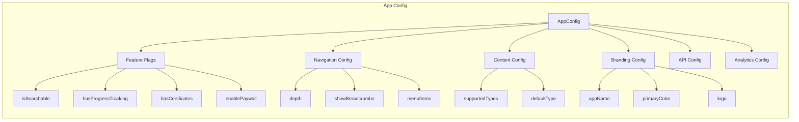
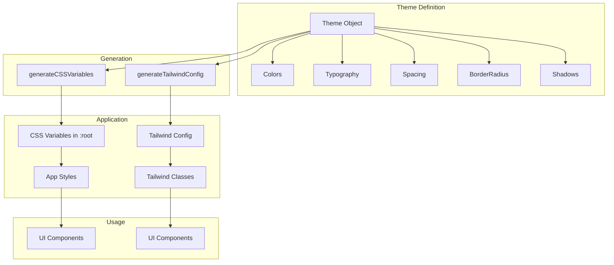
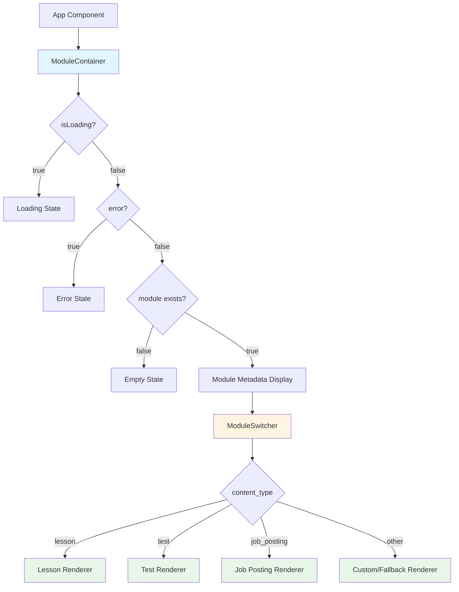
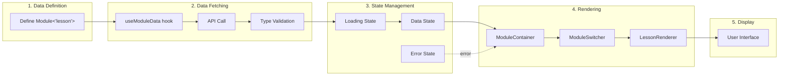
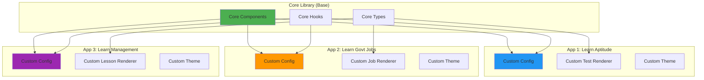

# Schema-Driven UI Architecture Diagrams

## System Architecture Overview



## Module Data Flow



## Content Type Switching



## Module Type Hierarchy



## App Configuration Structure



## Theme System Architecture



## Component Hierarchy



## Usage Pattern: From Data to UI



## Folder Structure Visualization

```
packages/core/
├── 📄 index.ts                 (Main export)
├── 📦 package.json
├── 🔧 tsconfig.json
├── 📖 README.md
├── 📋 FOLDER_STRUCTURE.md
│
├── 📁 types/                   (Type Definitions)
│   ├── module.types.ts         ⭐ Module<T> interface
│   └── config.types.ts         ⭐ AppConfig interface
│
├── 📁 components/              (React Components)
│   ├── ModuleContainer.tsx     ⭐ HOC wrapper
│   └── ModuleSwitcher.tsx      ⭐ Content switcher
│
├── 📁 hooks/                   (Custom Hooks)
│   └── useModuleData.ts        ⭐ Data fetching hook
│
├── 📁 theme/                   (Theming)
│   └── theme.ts                ⭐ Theme system
│
├── 📁 utils/                   (Utilities)
│   └── moduleUtils.ts          🛠️ Helper functions
│
├── 📁 config/                  (Sample Configs)
│   ├── learn-aptitude.config.json
│   ├── learn-govt-jobs.config.json
│   └── learn-management.config.json
│
└── 📁 examples/                (Usage Examples)
    └── usage.tsx
```

## Extension Pattern


